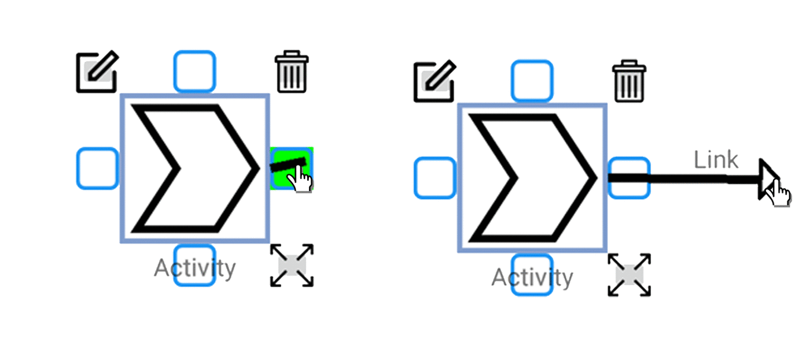

# Jérémie Huppé Portfolio

## Artificial Intelligence and Data Science Projects

## Software Projects

### MARVIN Intelligent Conversational Agent ꞏ University Master Year Team Project

A link to the complete demonstration can be found [here](https://www.youtube.com/watch?v=77pF1pDdl1Q&feature=emb_logo).

Timeline : Jan. to May 2020  
Type of application : Chatbot.  
Technologies used : Python, Rasa, Amazon Web Services' EC2 and Lambda instances, Facebook Messenger interface.  
Source code : _Private repository_  
Description :

-	Created a chatbot to promote HIV patients' engagement in care for the [McGill University Health Centre](https://muhc.ca/).
-	Used Facebook Messenger as interface and [Rasa](https://rasa.com/) to develop the conversational agent.
-	Developed scenarios to answer users’ questions related to HIV.
-	Connected SQL Databases to retrieve information about users, countries’ travel restrictions, and medication.
-	Maintained and deployed our Rasa servers and microservices on AWS EC2 and Lambda instances.

Authors : 

- [Geneviève Bock](https://github.com/GenevieveBock1)
- [Antoine Daigneault-Demers](https://github.com/antoine1242)
- [Mathieu Giroux-Huppé](https://github.com/mathieugh)
- [Maxime Gosselin](https://github.com/Maxime-Gosselin)
- [Jérémie Huppé](https://github.com/HuppeJ)
- [Alexandre Rault](https://github.com/AlexandreRault)

### UML Multi-user Editor ꞏ University 3rd Year Team Project

Timeline : Jan. to May 2019  
Type of application : Android Application.  
Technologies used : Typescript, Kotlin, Node.js, Socket.io, Google CLoud Platform's App Engine and Datastore.  
Source code :  [UML-Multi-User-Editor](https://github.com/HuppeJ/UML-Multi-User-Editor).  
Description :

-	Built the server-side application for managing multi-user interactions and data persistence with Node.js and Socket.io. Maintained the server application and database on Google Cloud Platform throughout the hole project.
-	Developed multi-user interaction features for the Android application using Kotlin.
-	Created a project plan for the three teams of two persons: Server Team, Android Team and Desktop Team. Estimated development time of each feature for each team and created a schedule detailing the deadline of each feature.

Authors : 

- [Geneviève Bock](https://github.com/GenevieveBock1)
- [Antoine Daigneault-Demers](https://github.com/antoine1242)
- [Mathieu Giroux-Huppé](https://github.com/mathieugh)
- [Maxime Gosselin](https://github.com/Maxime-Gosselin)
- [Jérémie Huppé](https://github.com/HuppeJ)
- [Alexandre Rault](https://github.com/AlexandreRault)

### Query Expression Builder ꞏ Coveo Internship Project

Timeline : May to Sept. 2018.  
Type of application : Web Application.  
Technologies used : Typescript, React, Redux.  
Source code : _Private repository_.  
Description :

-	Created a web-based tool using Typescript, React and Redux, allowing non-programmer users to easily generate query expressions to select the results they wish to select. Making sure the tool was intuitive and easy to use while offering multiple features was a great challenge.
-	Taught myself React and Redux in 2 weeks and collaborated with Coveo UI Components Team and Coveo UX Team to develop the Query Expression Builder.

Author : 

- [Jérémie Huppé](https://github.com/HuppeJ)

