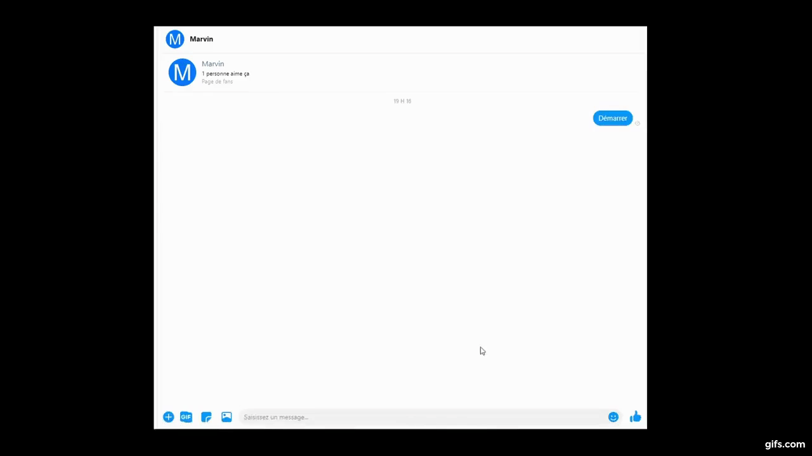

# Jérémie Huppé Portfolio

- [Jérémie Huppé Portfolio](#jérémie-huppé-portfolio)
  - [Artificial Intelligence and Data Science Projects](#artificial-intelligence-and-data-science-projects)
    - [Market Basket Analysis ꞏ University Project](#market-basket-analysis-ꞏ-university-project)
    - [Ontology for Music Festival and Shows ꞏ University Project](#ontology-for-music-festival-and-shows-ꞏ-university-project)
    - [Mining Software Requirements from Unstructured Text ꞏ Polytechnique Montreal Research Internship Project](#mining-software-requirements-from-unstructured-text-ꞏ-polytechnique-montreal-research-internship-project)
    - [Other Projects](#other-projects)
      - [Naive Bayes Classifier](#naive-bayes-classifier)
      - [Multilayer Perceptron Neural Network with Backpropagation](#multilayer-perceptron-neural-network-with-backpropagation)
      - [Encoder and Decoder Deep LSTM Architecture with Attention](#encoder-and-decoder-deep-lstm-architecture-with-attention)
  - [Software Projects](#software-projects)
    - [MARVIN Intelligent Conversational Agent ꞏ University Master Year Team Project](#marvin-intelligent-conversational-agent-ꞏ-university-master-year-team-project)
    - [UML Multi-user Editor ꞏ University 3rd Year Team Project](#uml-multi-user-editor-ꞏ-university-3rd-year-team-project)
    - [Query Expression Builder ꞏ Coveo Internship Project](#query-expression-builder-ꞏ-coveo-internship-project)
    - [Other Projects](#other-projects-1)
      - [Beat Tracking of Music Recording](#beat-tracking-of-music-recording)
      - [Panorama Construction](#panorama-construction)

## Artificial Intelligence and Data Science Projects

### Market Basket Analysis ꞏ University Project                    

Timeline : Sept. to Dec. 2019  
Type of application : Notebook.  
Technologies used : Python, Apache Spark, SQL, Google Cloud Platform.  
Source code : [Market Basket Analysis](https://github.com/HuppeJ/portfolio/blob/master/projects/MBA.ipynb).  
Description :

- Implemented a MapReduce algorithm for Market Basket Analysis using the Apache Spark framework.
- Ran our Market Basket Analysis algorithm on the whole [instacart](https://www.instacart.com/datasets/grocery-shopping-2017) dataset using the Google Cloud Platform.
- Analyzed the results.

Authors : 

- [Jérémie Huppé](https://github.com/HuppeJ)
- [Alexandre Rault](https://github.com/AlexandreRault)

### Ontology for Music Festival and Shows ꞏ University Project                    

Timeline : Sept. to Dec. 2019  
Type of application : Data Representation Tool.  
Technologies used : RDFS, SPARQL.  
Source code : _Private repository_.  
Description :

- Created a simple ontology for music festival and shows using RDFS.
- Populated our ontology and wrote SPARQL queries to test the ontology. 

Authors : 

- [Jérémie Huppé](https://github.com/HuppeJ)
- [Alexandre Rault](https://github.com/AlexandreRault)

### Mining Software Requirements from Unstructured Text ꞏ Polytechnique Montreal Research Internship Project 

Timeline : May to Aug. 2019  
Type of application : Notebooks and Scripting Tools.  
Technologies used : Python, NLTK, scikit-learn, Stranford NLP Parser, Amazon Mechanical Turk.  
Source code : [jh-summer19](https://github.com/HuppeJ/jh-summer19).  
Description :

-	Retrieved unstructured text from forums and built datasets. 
-	Created different techniques to find the needs expressed in unstructured text: keyword matching, interrogative sentence analysis and more.
-	Processed the datasets and submitted samples to Amazon Mechanical Turk to get the data labelled.
-	Implemented and evaluated different machine learning classifier with scikit-learn. 

Author : 

- [Jérémie Huppé](https://github.com/HuppeJ)

### Other Projects

I have worked on many other relevant AI and data science projects. Those projects do not have a detailed description in this portfolio because I wanted to keep the portfolio short. Here is a list of some of those projects : 

#### Naive Bayes Classifier

Implemented a Naive Bayes classifier from scratch using Julia to predict the type of transport used by a Montrealer. The source code can be found [here](https://github.com/HuppeJ/portfolio/blob/master/projects/Naive_Bayes.ipynb). 

#### Multilayer Perceptron Neural Network with Backpropagation

Implemented a Multilayer Perceptron Neural Network with backpropagation from scratch using Python and evaluated the implementation with Fashion MNIST dataset. The source code can be found [here](https://github.com/HuppeJ/portfolio/blob/master/projects/MLP_NN.ipynb).

#### Encoder and Decoder Deep LSTM Architecture with Attention

Implemented the Encoder and Decoder Deep LSTM architecture with Attention presented in [Effective Approaches to Attention-based Neural Machine Translation](https://arxiv.org/abs/1508.04025) using TensorFlow 2 and analyzed the results. The source code can he found [here](https://github.com/HuppeJ/TraductionAutomatiqueNeuronaleBaseeSurLAttention/blob/master/Luong_Attention_Code_Source.ipynb) and the analysis [here](https://github.com/HuppeJ/TraductionAutomatiqueNeuronaleBaseeSurLAttention/blob/master/rapport.pdf).

## Software Projects

### MARVIN Intelligent Conversational Agent ꞏ University Master Year Team Project

A link to the complete demonstration can be found [here](https://www.youtube.com/watch?v=77pF1pDdl1Q&feature=emb_logo).

Timeline : Jan. to May 2020  
Type of application : Chatbot.  
Technologies used : Python, Rasa, Amazon Web Services' EC2 and Lambda instances, Facebook Messenger interface.  
Source code : _Private repository_  
Description :

-	Created a chatbot to promote HIV patients' engagement in care for the [McGill University Health Centre](https://muhc.ca/).
-	Used Facebook Messenger as interface and [Rasa](https://rasa.com/) to develop the conversational agent.
-	Developed scenarios to answer users’ questions related to HIV.
-	Connected SQL Databases to retrieve information about users, countries’ travel restrictions, and medication.
-	Maintained and deployed our Rasa servers and microservices on AWS EC2 and Lambda instances.

Authors : 

- [Geneviève Bock](https://github.com/GenevieveBock1)
- [Antoine Daigneault-Demers](https://github.com/antoine1242)
- [Mathieu Giroux-Huppé](https://github.com/mathieugh)
- [Maxime Gosselin](https://github.com/Maxime-Gosselin)
- [Jérémie Huppé](https://github.com/HuppeJ)
- [Alexandre Rault](https://github.com/AlexandreRault)

### UML Multi-user Editor ꞏ University 3rd Year Team Project

Timeline : Jan. to May 2019  
Type of application : Android Application.  
Technologies used : Typescript, Kotlin, Node.js, Socket.io, Google CLoud Platform's App Engine and Datastore.  
Source code :  [UML-Multi-User-Editor](https://github.com/HuppeJ/UML-Multi-User-Editor).  
Description :

-	Built the server-side application for managing multi-user interactions and data persistence with Node.js and Socket.io. Maintained the server application and database on Google Cloud Platform throughout the hole project.
-	Developed multi-user interaction features for the Android application using Kotlin.
-	Created a project plan for the three teams of two persons: Server Team, Android Team and Desktop Team. Estimated development time of each feature for each team and created a schedule detailing the deadline of each feature.

Authors : 

- [Geneviève Bock](https://github.com/GenevieveBock1)
- [Antoine Daigneault-Demers](https://github.com/antoine1242)
- [Mathieu Giroux-Huppé](https://github.com/mathieugh)
- [Maxime Gosselin](https://github.com/Maxime-Gosselin)
- [Jérémie Huppé](https://github.com/HuppeJ)
- [Alexandre Rault](https://github.com/AlexandreRault)

### Query Expression Builder ꞏ Coveo Internship Project

Timeline : May to Sept. 2018.  
Type of application : Web Application.  
Technologies used : Typescript, React, Redux.  
Source code : _Private repository_.  
Description :

-	Created a web-based tool using Typescript, React and Redux, allowing non-programmer users to easily generate query expressions to select the results they wish to select. Making sure the tool was intuitive and easy to use while offering multiple features was a great challenge.
-	Taught myself React and Redux in 2 weeks and collaborated with Coveo UI Components Team and Coveo UX Team to develop the Query Expression Builder.

Author : 

- [Jérémie Huppé](https://github.com/HuppeJ)

### Other Projects

#### Beat Tracking of Music Recording

Explained to my classmates the principles of music beat tracking by detailing the Novelty curve, the Fourier Tempogram and the Predominant Local Pulse (PLP) concepts. Broke down into snippets of codes each step needed to find the PLP of a music recording using Python. The notebook can be found [here](https://colab.research.google.com/drive/1NvOjQKgj_7n2x9ZkKV7c96XJlkyDVwWZ?usp=sharing).

#### Panorama Construction

Panorama construction by registration, key-points, descriptors and homography. Created a panorama construction algorithm based on Scale-Invariant Feature Transform (SIFT) feature detection algorithm. 